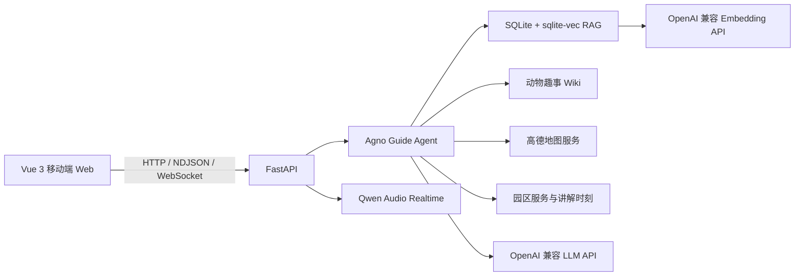

---
datasets:
  evaluation: null
  test: null
  train: null
domain: multi-modal
license: CC-BY-NC-4.0
models: null
tags:
- 动物园导览
- 智能体
- 地图导航
---

<div align="center">
  

  <h1>森友会 · Awesome Animal Helper</h1>

  **面向南京市红山森林动物园的多模态智能导览 Agent**

  问动物、听故事、查服务、规划路线，在城市的森林里认识每一位邻居。

  [](https://www.python.org/)
  [](https://vuejs.org/)
  [](https://fastapi.tiangolo.com/)
  [](https://www.agno.com/)
  [](https://www.modelscope.cn/studios/yuanyyt/awesome_animal_helper)
  [](https://creativecommons.org/licenses/by-nc/4.0/)

  [在线体验](https://www.modelscope.cn/studios/yuanyyt/awesome_animal_helper) · [快速开始](#快速开始) · [功能特性](#功能特性) · [部署指南](#docker-部署)
</div>

## 项目简介

森友会将动物图鉴、园区故事、本地知识库、高德地图与实时语音整合进同一个导览 Agent。用户可以直接用自然语言提出混合问题，例如：

> 园区内有哪些小熊猫？如果现在从北门出发去看小熊猫应该怎么走？

Agent 会自主判断需要调用的工具，在一轮回答中同时完成 Wiki/RAG 检索和路线规划。地图、动物详情、路线结果与人工确认（HITL）均在同一移动端友好的对话界面中呈现。

## 功能特性

- **智能动物问答**：联合检索结构化物种资料、场馆讲解和公众号动物故事。
- **混合意图处理**：Wiki、RAG、路径规划和园区服务作为独立工具暴露给 Agent，可在同一轮并行调用。
- **园内路线规划**：支持用户定位、地图选点、指定入口、步行与观光车组合方案，并可跳转高德地图。
- **园区服务查询**：覆盖游客服务、卫生间、餐饮、饮水、商店、文创、交通和讲解时刻。
- **实时语音导览**：支持浏览器录音、语音转写和回答播报，文字与语音共享同一会话。
- **动物邻居图鉴**：按场馆筛选与搜索动物，展示简介、趣事及相关园区故事。
- **移动端优先**：适配软键盘、流式消息滚动、地图预览、HITL 表单和底部导航。
- **私有化部署**：提供多阶段 Docker 构建，适配 ModelScope Studio，运行时密钥不进入镜像。

## 技术架构



| 层级 | 技术 | 职责 |
| --- | --- | --- |
| 前端 | Vue 3、TypeScript、Vite | 动物图鉴、对话、地图、路线与语音交互 |
| API | FastAPI、WebSocket、NDJSON | 接口编排、流式回答与实时音频桥接 |
| Agent | Agno、OpenAI 兼容模型 | 意图判断、并行工具调用、HITL 与会话管理 |
| 知识库 | SQLite、sqlite-vec | 结构化资料、讲解内容和向量检索 |
| 地图 | 高德 Web Service / JS API | POI、园内步行路线、服务设施与地图渲染 |
| 数据管线 | Wikipedia、Wikidata、LLM | 动物资料与公众号 Wiki 的清洗构建 |

## 快速开始

### 环境要求

- Python 3.12+
- [uv](https://docs.astral.sh/uv/)
- Node.js 22+
- npm 10+

### 1. 克隆并安装依赖

```bash
git clone https://github.com/yuanyyt/awesome-animal-helper.git
cd awesome-animal-helper

uv sync
npm install --prefix src/frontend
```

也可以从 ModelScope 克隆：

```bash
git clone https://www.modelscope.cn/studios/yuanyyt/awesome_animal_helper.git
```

### 2. 配置环境变量

在项目根目录创建 `.env`：

```dotenv
# LLM（必填）
DASHSCOPE_API_KEY=your-api-key
LLM_BASE_URL=https://your-openai-compatible-endpoint/v1
LLM_MODEL=your-model-name

# 高德地图（必填）
AMAP_WEBSERVICE_KEY=your-web-service-key
JS_API_KEY=your-js-api-key
SECURITY_KEY=your-js-api-security-key
```

`.env` 已被 Git 忽略，请勿将真实密钥提交到仓库。

### 3. 启动开发服务

终端一：

```bash
uv run uvicorn src.backend.main:app --reload
```

终端二：

```bash
npm run dev --prefix src/frontend
```

访问 <http://127.0.0.1:5173>，接口文档位于 <http://127.0.0.1:8000/docs>。Vite 会将 `/api`、WebSocket 和 `/_AMapService` 请求代理到 FastAPI。

## 配置说明

| 变量 | 必需 | 默认值 | 用途 | 部署建议 |
| --- | :---: | --- | --- | --- |
| `DASHSCOPE_API_KEY` | 是 | — | LLM、Embedding 与实时音频鉴权 | 密文 |
| `LLM_BASE_URL` | 是 | — | OpenAI 兼容接口地址 | 明文 |
| `LLM_MODEL` | 是 | — | 导览 Agent 使用的模型 | 明文 |
| `AMAP_WEBSERVICE_KEY` | 是 | — | 服务端 POI 与路径规划 | 密文 |
| `JS_API_KEY` | 是 | — | 浏览器加载高德 JS API | 明文 |
| `SECURITY_KEY` | 是 | — | 高德 JS API 安全密钥，仅由后端代理使用 | 密文 |
| `LLM_ENABLE_THINKING` | 否 | `false` | 是否开启模型思考模式 | 明文 |
| `EMBEDDING_BASE_URL` | 否 | `LLM_BASE_URL` | 独立 Embedding 服务地址 | 明文 |
| `EMBEDDING_MODEL` | 否 | `text-embedding-v4` | Embedding 模型 | 明文 |
| `EMBEDDING_DIMENSIONS` | 否 | `1024` | 向量维度 | 明文 |
| `AUDIO_REALTIME_BASE_URL` | 否 | 由 `LLM_BASE_URL` 转换 | 实时语音 WebSocket 地址 | 明文 |
| `AUDIO_REALTIME_MODEL` | 否 | `qwen-audio-3.0-realtime-flash` | 实时语音模型 | 明文 |
| `AUDIO_REALTIME_VOICE` | 否 | `longanqian` | 播报音色 | 明文 |
| `APP_RUNTIME_DIR` | 否 | `src/data/runtime` | SQLite 运行时目录 | 明文 |

> `SECURITY_KEY` 不会返回给浏览器；高德 JS API 加载失败时，界面会回退到后端提供的静态地图。

## 核心能力

### Agent 与知识检索

Agent 始终可以使用下列独立工具，并根据完整问题自主选择和组合：

- `search_animal_knowledge`：检索 CSV 物种资料与 `intro.md` 场馆讲解。
- `get_neighboring_knowledge_chunks`：按 Chunk ID 补充同章节上下文。
- `search_animal_wiki_stories`：检索昵称、个体、饲养训练与公众号故事。
- 路径规划工具：解析入口、场馆、设施与观光车站，调用高德生成路线。
- 园区服务工具：查询商店、文创、餐饮、游客服务和交通设施。
- `get_zoo_education_schedule`：查询科普讲解与行为训练展示时间。

知识库默认位于 `src/data/runtime/knowledge.db`，首次启动时自动构建。源数据更新后可手动重建：

```bash
uv run python -m src.backend.knowledge rebuild
```

会话保存在 `src/data/runtime/guide_agent.db`。对话仅保留最近三轮文本，不重复发送历史工具结果和路线坐标，以控制上下文与响应延迟。

### 路线与地图

- 用户问题中明确给出的起点优先于浏览器定位和默认起点。
- 未指定出行方式时，同时考虑步行与观光车；仅在规划完整游园行程且缺少必要偏好时触发 HITL。
- 观光车方案根据实时上海时间判断运营状态，按 12 km/h 和平均候车 5 分钟估算。
- 步行路线、观光车环线和不同类别的园区服务在地图中使用独立配色。
- 距离、用时与路线坐标来自高德；参观时间、体力与卡路里会明确标注为估算值。

### 实时语音

浏览器通过 `WS /api/guide/voice` 向 FastAPI 发送 16 kHz、16-bit、单声道 PCM 音频。后端完成转写并调用与文字请求相同的 Agent，回答生成完成后再通过 24 kHz PCM 播报。API Key 不会下发到前端。

麦克风需要 `localhost` 或 HTTPS 安全上下文；拒绝权限后仍可继续使用文字导览。

## 数据构建

### 动物基础资料

默认读取 `src/data/animal_sites.xlsx`，并将结果写入 `src/data/animals.csv`。

仅使用 Wikipedia 与 Wikidata：

```bash
uv run python -m src.crawler --no-llm
```

启用 LLM 清洗：

```bash
LLM_API_KEY=your-api-key \
LLM_MODEL=your-model-name \
LLM_BASE_URL=https://your-openai-compatible-endpoint/v1 \
uv run python -m src.crawler
```

可通过 `--proxy-file`、`--delay` 和 `--jitter` 控制代理与请求间隔。遇到 `429` 时，程序会遵循 `Retry-After` 并进行指数退避。

### 公众号动物 Wiki

项目不包含微信公众号爬虫。请使用 [bzd6661/wechat-article-for-ai](https://github.com/bzd6661/wechat-article-for-ai) 将文章整理为带 YAML front matter 的 Markdown，并输出到：

```text
src/data/wx_info/output/
└── 文章标题/
    ├── 文章标题.md
    └── images/
```

抓取完成后，在项目根目录执行：

```bash
uv run python -m src.crawler.wechat_wiki build \
  --articles src/data/wx_info/output \
  --wiki src/data/wx_info/wiki
```

生成内容按 `场馆 / 动物学名 / 动物名.md` 分层保存，同时产出 `manifest.json`、`index.md` 和构建报告。详细说明见 [动物趣事 Wiki 数据管线](src/data/wx_info/README.md)。

## API 概览

| 接口 | 说明 |
| --- | --- |
| `GET /api/animals` | 查询动物，支持 `q`、`site`、`name` |
| `GET /api/wiki` | 搜索动物趣事 Wiki |
| `GET /api/wiki/page` | 获取指定动物 Wiki 页面 |
| `GET /api/map` | 获取场馆、设施、边界与高德配置 |
| `GET /api/map/image` | 获取静态地图回退图 |
| `POST /api/guide/chat/stream` | 以 NDJSON 流式返回 Agent 回答 |
| `POST /api/guide/chat/{run_id}/continue/stream` | 提交 HITL 结果并继续生成 |
| `WS /api/guide/voice` | 实时语音输入与播报 |

完整请求与响应模型请启动服务后查看 Swagger UI：<http://127.0.0.1:8000/docs>。

## Docker 部署

构建并启动：

```bash
docker build -t awesome-animal-helper:local .
docker run --rm -p 7860:7860 \
  --env-file .env \
  -v awesome-animal-runtime:/mnt/workspace/awesome-animal-helper/runtime \
  awesome-animal-helper:local
```

访问 <http://127.0.0.1:7860>。

网络较慢时可以在构建阶段切换镜像站：

```bash
docker build -t awesome-animal-helper:local \
  --build-arg NODE_IMAGE=docker.m.daocloud.io/library/node:22-bookworm-slim \
  --build-arg PYTHON_IMAGE=docker.m.daocloud.io/library/python:3.12-slim-bookworm \
  --build-arg NPM_REGISTRY=https://registry.npmmirror.com \
  --build-arg PYPI_INDEX_URL=https://mirrors.aliyun.com/pypi/simple \
  .
```

镜像采用多阶段构建。最终镜像仅包含 Vue 构建产物、后端字节码、运行依赖与必要数据，不包含 Git 历史、`.env`、公众号原始抓取结果或 Python 源文件。字节码仍可能被专业工具逆向，浏览器端 JavaScript 与公开接口内容也无法对访问者保密。

### ModelScope Studio

ModelScope Studio 会使用仓库根目录的 `Dockerfile`，并在 `0.0.0.0:7860` 提供前端、API 与 WebSocket。部署时：

1. 将 `DASHSCOPE_API_KEY`、`AMAP_WEBSERVICE_KEY` 和 `SECURITY_KEY` 配置为**密文变量**。
2. 将模型名、接口地址、`JS_API_KEY` 及其他开关配置为**明文变量**。
3. 为 `/mnt/workspace/awesome-animal-helper/runtime` 启用持久化存储。

在线实例：<https://www.modelscope.cn/studios/yuanyyt/awesome_animal_helper>

## 项目结构

```text
awesome-animal-helper/
├── src/
│   ├── backend/
│   │   ├── agents/          # Agent 与工具定义
│   │   ├── api/             # FastAPI 路由与依赖生命周期
│   │   ├── integrations/    # 高德地图与实时音频
│   │   ├── knowledge/       # SQLite / sqlite-vec 知识库
│   │   ├── repositories/    # 本地动物与 Wiki 数据访问
│   │   └── services/        # 路线、园区服务与业务逻辑
│   ├── crawler/             # Wikipedia / Wikidata 与 Wiki 构建器
│   ├── data/                # 动物、场馆、讲解和故事数据
│   └── frontend/            # Vue 3 移动端 Web 应用
├── tests/                   # 后端与数据管线测试
├── Dockerfile
├── pyproject.toml
└── README.md
```

## 开发与验证

```bash
# 后端测试
uv run pytest -q

# 前端类型检查
npm run type-check --prefix src/frontend

# 前端生产构建
npm run build --prefix src/frontend
```

## 数据与安全说明

- 动物个体、展示安排、服务设施和开放状态可能随园区实际运营调整，请以现场公告为准。
- 高德路线与距离来自第三方地图服务；园内步道数据存在变化时，请优先遵循现场指引。
- 公众号内容的抓取、处理与使用应遵守来源平台规则及相应著作权要求。

## 致谢

- [南京市红山森林动物园](https://www.njhszoo.com/)
- [高德开放平台](https://lbs.amap.com/)
- [bzd6661/wechat-article-for-ai](https://github.com/bzd6661/wechat-article-for-ai)
- Wikipedia 与 Wikidata 社区

## 许可证

项目元数据声明采用 [CC BY-NC 4.0](https://creativecommons.org/licenses/by-nc/4.0/deed.zh-hans) 许可。第三方数据、图片、商标与服务分别遵循其各自条款。
